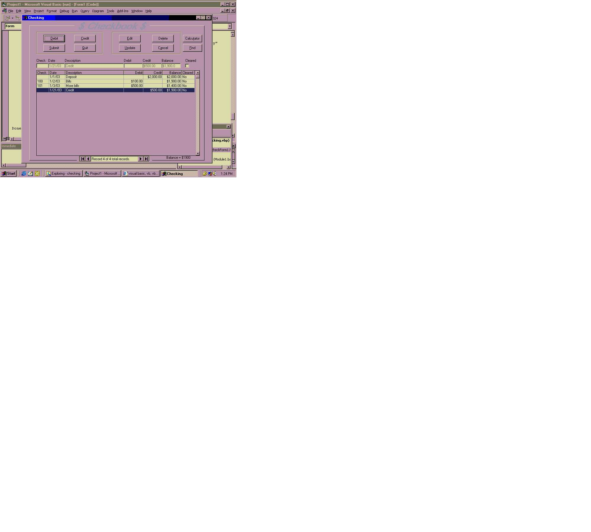



## Easy Checkbook

### Description

Checkbook using Access db. Retrieve with basic SQL(SELECT, ORDER BY). DBGrid, maskedbox, Find/FindNext, Shell. Lots of buttons. The code is pretty straight forward. I've been using it for

a while & its accurate & helpful when I need to look back at something.
 
### More Info
 
Access db.

None found.

             |
---                |---
**Submitted On**   |2003-01-21 12:31:32
**By**             |[David Zielke](https://github.com/Planet-Source-Code/PSCIndex/blob/master/ByAuthor/david-zielke.md)
**Level**          |Intermediate
**User Rating**    |4.8 (29 globes from 6 users)
**Compatibility**  |VB 5\.0, VB 6\.0
**Category**       |[Complete Applications](https://github.com/Planet-Source-Code/PSCIndex/blob/master/ByCategory/complete-applications__1-27.md)
**World**          |[Visual Basic](https://github.com/Planet-Source-Code/PSCIndex/blob/master/ByWorld/visual-basic.md)
**Archive File**   |[Easy\_Check1532671212003\.zip](https://github.com/Planet-Source-Code/david-zielke-easy-checkbook__1-42618/archive/master.zip)

